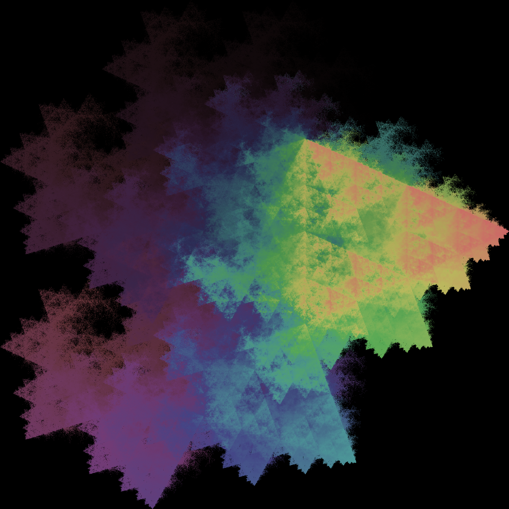

# Fast IFS Fractal Generation with PyTorch on GPU

This repository contains Python scripts for generating fractal images using Iterated Function Systems (IFS) with customizable configurations. The scripts utilize PyTorch for computations, allowing for GPU acceleration.




## Key Components

- `examples.py`: Demonstrates how to generate fractals using predefined configurations.
- `fractal_config.py`: Contains definitions for various fractal configurations.
- `gen_ifs_fractal.py`: Defines the `IFSFractal` class and methods for generating and rasterizing fractals.

## Custom Fractal Configurations

You can create custom fractal configurations by modifying or creating instances of `FractalConfig` in `fractal_config.py`. Each configuration requires:
- `name`: A unique name for the fractal.
- `transformations`: A list of tuples, each containing a transformation matrix and a translation vector.
- `colors`: A list of RGB color tuples for each transformation.
- `probability_weights`: (Optional) A list of probabilities for each transformation.
- `activation`: (Optional) The activation function to use (e.g., 'none', 'relu', 'sigmoid'). Default is 'selu'.
- `batch_size`: The number of points to process in each batch.
- `num_iterations`: The number of iterations to perform.

Example configuration:
```python
SIERPINSKI_TRIANGLE = FractalConfig(
    name="SierpinskiTriangle",
    transformations=(
        (torch.tensor([
            [0.5, 0.0],
            [0.0, 0.5]
        ]), torch.tensor([0.0, 0.0])),
        (torch.tensor([
            [0.5, 0.0],
            [0.0, 0.5]
        ]), torch.tensor([0.5, 0.0])),
        (torch.tensor([
            [0.5, 0.0],
            [0.0, 0.5]
        ]), torch.tensor([0.25, 0.5]))
    ),
    colors=(
        (0, 127.5, 205),
        (255, 127.5, 10),
        (180, 190, 254)
    ),
    num_iterations=200000,
)
```

### "Composing" Fractals
Fractal configurations can be composed easily
```python
A_comp_B = FractalConfig(
    name="A_comp_B",
    transformations=(
        *fractal_A.transformations,
        *fractal_B.transformations
    ),
    colors=(
        *fractal_A.colors,
        *fractal_B.colors
    ),
    probability_weights=(1., 1., 8., 8., 8., 1., 1., 8.),
    activation='selu',
)
```

## Usage

To generate fractals, you can use the `generate_fractal_image` function in `gen_ifs_fractal.py`. For example:
```python
image = generate_fractal_image(SIERPINSKI_TRIANGLE, 
                               device='cuda', 
                               size=8192, 
                               batch_size=1000000)
image.save('sierpinski_triangle.png')
```

## Gallery


## Color Spaces
Averaging the colors of the fractal points in each iteration results in a single color for each point. The color is then mapped to a color space and the image is rasterized. I have found that HSL creates the most interesting results.

RGB


HSL

